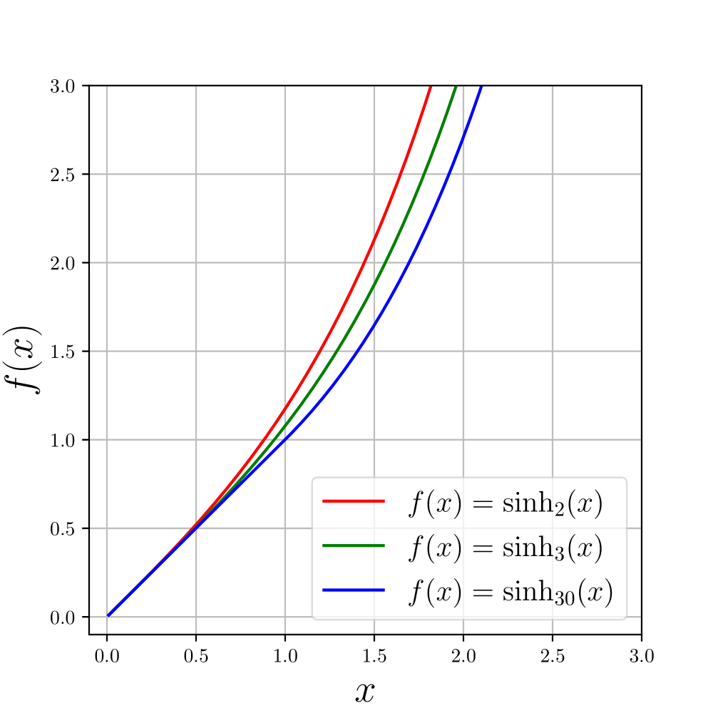

# Unified-NAG

This repository includes codes to generate the figures presented in the paper "Unifying Nesterov’s Accelerated Gradient Methods for Convex and Strongly Convex Objective Functions" [(Kim & Yang, 2023)][kim2023].

## Results

### icml_coefficient_Xdot_simpler.py
Figure 1: Figure 1. Plots for the coefficient of the velocity term.

### logistic_regression.py
Figure 2: Results for the ℓ2-regularized logistic regression problem.

### linear_regression.py
Figure 3: Results for the cubic-regularized linear regression problem.

### hyperbolic.py
Figure 4 in the appendix: Hyperbolic functions and their variants.

### hyperbolic_higher.py
Figure 5 in the appendix: Higher-order hyperbolic functions.

[kim2023]: https://proceedings.mlr.press/v202/kim23y/kim23y.pdf

# 
